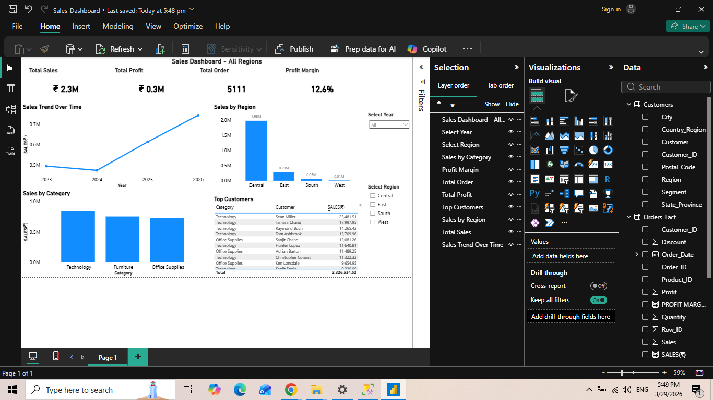

# Sales Analytics Dashboard (SQL + Power BI)

## Project Overview

This project analyzes sales data using SQL and presents insights through an interactive Power BI dashboard.
It demonstrates end-to-end data analysis, including data querying, transformation, and visualization to support business decision-making.

---

## Documentation

- [Project White Paper](Docs/Sales_Analytics_White_Paper.pdf)

---
## Tools & Technologies

* SQL Server
* Power BI
* CSV Dataset

---

## Project Structure

```
Sales-Analytics-SQL-PowerBI/
│
├── Docs/
│   └── Sales_Analytics_White_Paper.pdf
│
├── PowerBI_Dashboard/
│   ├── Sales_Dashboard.pbix
│   └── Sales_Dashboard_ScreenShot.png
│
├── sql_queries/
│   └── Analysis.sql
│
├── dataset/
│   └── sample_superstore.csv
│
└── README.md
```

---

## Key Insights

* Analyzed total sales and profit across regions
* Identified monthly sales trends and seasonality
* Determined top-performing products within each category
* Evaluated regional performance for business insights
* Conducted category and sub-category level analysis

---

## SQL Concepts Used

* Aggregate Functions (SUM, COUNT)
* GROUP BY and ORDER BY
* Window Functions (RANK)
* Date Functions (YEAR, MONTH)

---

## Power BI Features

* KPI cards for key metrics
* Category-wise and region-wise visualizations
* Time-series analysis using line charts
* Clean and structured dashboard layout

---

## Dashboard Preview



---

## Business Impact

* Enabled data-driven decision-making
* Identified high-performing products and regions
* Highlighted trends for strategic planning

---

## Author

Aditya Pandey
